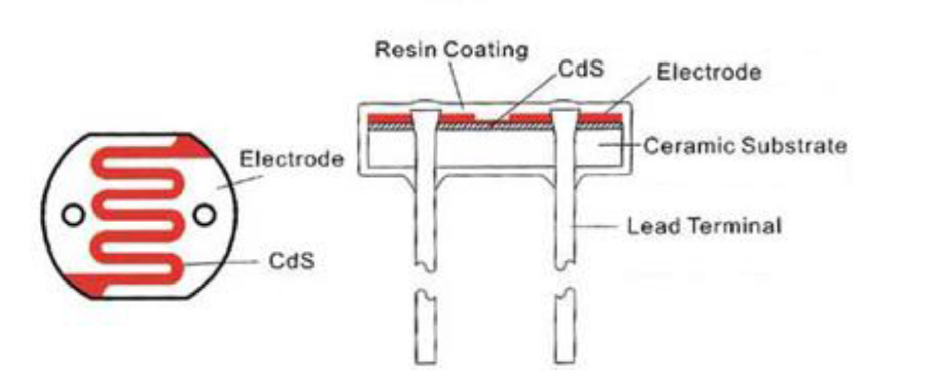
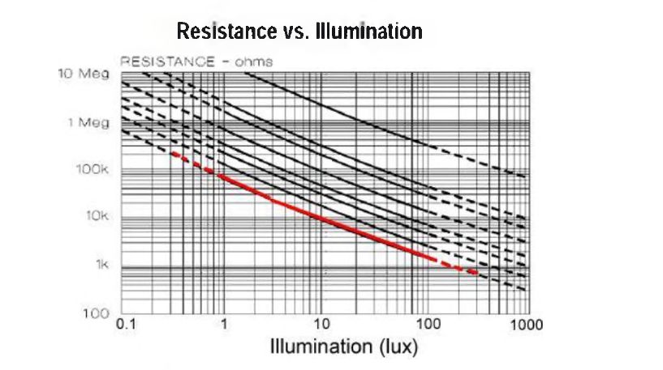
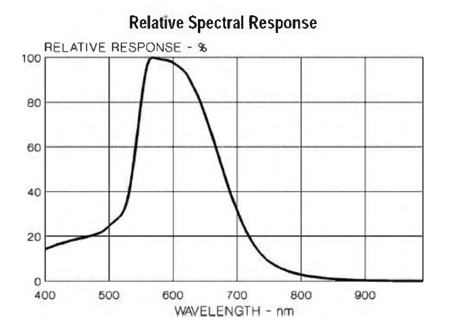
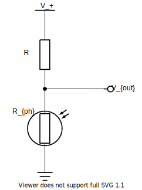
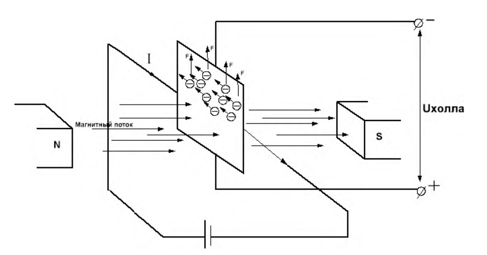
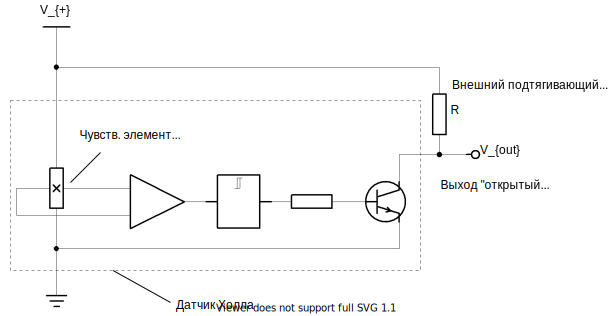

# Теория к лабораторной работе № 1 "Фоторезистор как датчик освещённости. Датчик Холла для измерения магнитного поля"

- [Фоторезистор](#фоторезистор)
  - [Измерение уровня освещённости:](#измерение-уровня-освещённости)
- [Датчик Холла](#датчик-холла)

## Фоторезистор

Изменение электрического сопротивления полупроводника, обусловленное непосредственным действием излучения, называют фоторезистивным эффектом, или внутренним фотоэлектрическим эффектом. Изменение сопротивления, или проводимости, вызывают изменением концентрации носителей заряда.

Фоторезисторы предоставляют возможность определять интенсивность освещения. Они миниатюрны, недорогие, требуют мало энергии, легки в использовании, практически не подвержены износу. Именно из-за этого они часто используются в игрушках, гаджетах и приспособлениях.
Фоторезисторы имеют различные размеры и технические характеристики, но в большинстве своем не очень точные. Каждый фоторезистор ведет себя несколько иначе по сравнению с другим, даже если они из одной партии от производителя. Различия в показаниях могут достигать 50% и даже больше! Так что рассчитывать на прецизионные измерения не стоит. В основном их используют для определения общего уровня освещенности в конкретных, "локальных", а не "абсолютных" условиях.

|  |
| :-----------------------------------------------------------: |
|              *Рис. 1. Устройство фоторезистора*               |

**Основные параметры фоторезисторов:**
* диапазон сопротивления: от 200 кОм (темно) до 10 кОм (светло);
* диапазон чувствительности: чувствительные элементы фиксируют длины волн в диапазоне от 400 нм (фиолетовый) до 600 нм (оранжевый).

### Измерение уровня освещённости:

Как известно, сопротивление фоторезистора изменяется в зависимости от уровня освещения. Когда темно, сопротивление резистора увеличивается до 10 МОм. С увеличением уровня освещенности сопротивление падает. Приведенный ниже график приблизительно отображает зависимость сопротивление сенсора от уровня освещенности. В общем, характеристика каждого отдельного фоторезистора будет несколько отличаться, эти характеристики отображают только общую тенденцию.

|  |
| :--------------------------------------------------------------------------------------------------: |
|              *Рис. 2. Сопротивление фоторезистора в зависимости от уровня освещённости*              |

Обратите внимание, что характеристика нелинейная, а имеет логарифмический характер.

В качестве примера уровней освещенности при различных услолвиях ниже приведена таблица 1.

*Таблица 1. Уровени освещенности, воспринимаемые человеком*

|    Освещение    |                           Пример                           |
| :-------------: | :--------------------------------------------------------: |
|    0.002 лк     |                   Безлунное чистое небо                    |
|     0.2 лк      |   Необходимый минимум для экстренного освещения (AS2293)   |
|    0.27-1 лк    |             Чистое ночное небо при полной луне             |
|     3.4 лк      |      Граничный уровень освещённости под чистым небом       |
|      50 лк      |                       Жилая комната                        |
|      80 лк      |                        Холл, туалет                        |
|     100 лк      |                    Очень пасмурный день                    |
|   300-500 лк    | Восход или закат в солнечный день. Хорошо освещеённый офис |
|     1000 лк     |    Втооая половина дня; освещение телевизионных студий     |
| 10000-25000 лк  |             Полдень (не прямые солнечные лучи)             |
| 32000-130000 лк |                   Прямые солнечные лучи                    |

Фоторезисторы не воспринимают весь диапазон световых волн. В большинстве исполнений они чувствительны к световым волнам в диапазоне между 700 нм (красный) и 500 нм (зеленый).

|  |
| :-----------------------------------------------------------------------------------------: |
|                    *Рис. 3. Спектральная чувствительность фоторезситора*                    |

Фоторезистор включается в схему измерения, которая представляет собой делитель напряжения. Выходной сигнал снимается с нижнего плеча делителя, который представляет собой падение напряжения на фоторезисторе. Это напряжение можно измерить с помощью АЦП микроконтроллера.

|  |
| :--------------------------------------------------------------: |
|             *Рис. 4. Схема включения фоторезистора*              |

Выходной сигнал схемы измерения - падение напряжения на фоторезисторе, вычисляется по следующей формуле:

$$V_{out} = V_{+} \cdot \frac{R_{ph}}{R + R_{ph}},$$

где $V_{+}$ - напряжение питания схемы (5В);

$R_{ph}$ - сопротивление фоторезистора при данном уровне освещённости;

$R$ - сопротивление верхнего плеча делителя напряжения, $R=1 кОм$;

Отсюда по известному падению напряжения $V_{+}$ и резистора $R$ можно найти сопротивление фоторезистора:

$$R_{ph} = R \frac{V_{out}}{V_{+}-V_{out}}$$

Связь сопротивления фоторезистора $R_{ph}$ с уровнем освещенности $L$ можно аппроксимировать следующей формулой:

$$L = 531.21 \cdot R_{ph}^{-5/4}$$

---

## Датчик Холла

Если через квадратную проводящую пластину пропустить постоянный ток, а саму пластину пронизать магнитным полем, чтобы линии индукции проходили через неё, то движущиеся по пластине электроны отклоняются силой Лоренца. Таким образом, с одного края электронов будет больше, чем с другой. Возникает разность потенциалов, то есть напряжение. И чем больше ток и сильней поле, тем большая разность будет.

|  |
| :---------------------------------------------------------------------------------------------------: |
|             *Рис. 5. Проявление эффекта Холла при протекании тока через тонкую пластину*              |

Разновидности датчиков на эффекте Холла:
- **униполярные** (unipolar): низкое состояние выхода соответствует приложенному южному полюсу магнита, высокое - удалению магнита; на северный полюс датчики не реагируют;
- **биполярные** (bipolar): низкое состояние выхода соответствует приложенному южному полюсу магнита, высокое - северному полюсу; при удалении магнита состояние датчика не определено;
- **омниполярные** (latching): низкое состояние выхода соответствует приложенному южному полюсу магнита, высокое - северному полюсу; при удалении магнита состояние выхода не меняется, т.е. срабатывание датчика происходит только при смене полюсов.

В обучающем стенде представлен дискретный датчик магнитного поля на эффекте Холла. Сигнальный выход представляет из себя открытый коллектор, подтянутый резистором к питанию датчика (Рис. 6). 

|  |
| :--------------------------------------------------------------------------------------: |
|              *Рис. 6. Внутренне устройство датчика Холаа и схема включения*              |

Внутри микросхемы датчика сигнал с чувствительного элемента на эффекте Холла (генератор Холла) усиливается, далее через триггер Шмитта поступает на базу выходного транзистора, коллектор которого остается открытым. Схема подключения датчика включает в себя питание и подтягивающий резистор $R$ на выход микросхемы датчика.

При поднесении к нему магнита нужной полярностью (правильной стороной) сигнальный вывод соединяется с общим проводом через п-р-п переход. Такие датчики как [АЗ144](A3141-2-3-4-Datasheet.pdf) находят применение вместо морально устаревших герконов, в енкодерах, при измерении силы тока и в индикаторах вращения. Их можно применять как в релейной логике, просто подключив к выходу катушку электромагнитного реле, так и совместно с микроконтроллерами в качестве дискретного датчика холла.