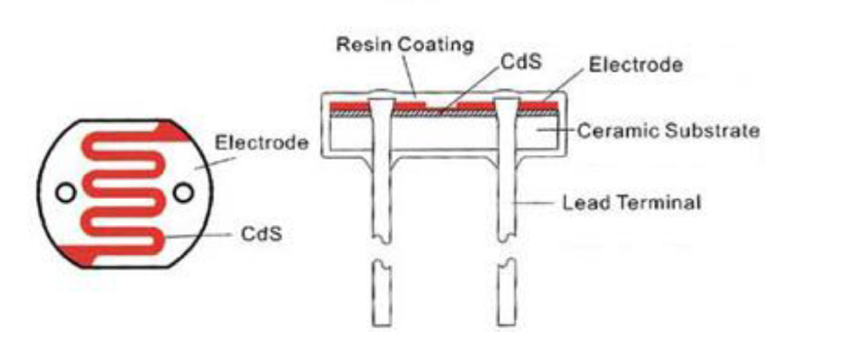
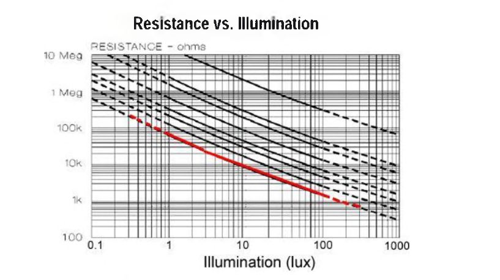
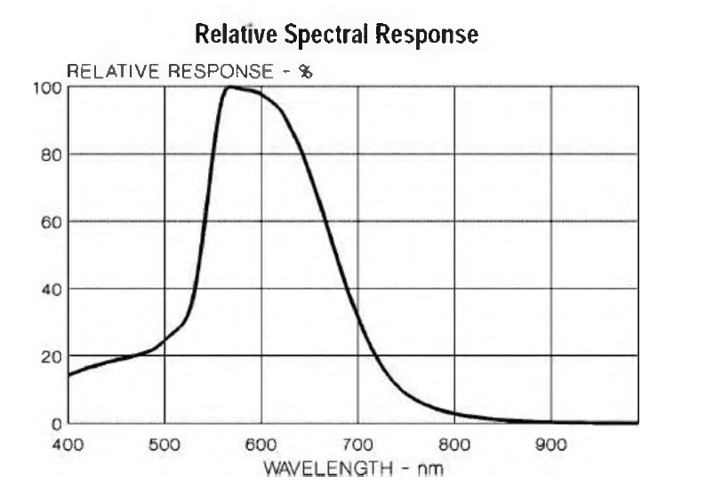

# Теория к лабораторной работе № 1 "Фоторезистор как датчик освещённости. Датчик Холла для измерения магнитного поля"

Фоторезисторы предоставляют возможность определять интенсивность освещения. Они малснькис, недорогис, трсбуют мало энсргии, легки в использовании, практически не подвержены износу. Именно из-за этого они часто используются в игрушках, гаджетах и приспособлениях.

Фоторезисторы по своей сути являются резисторами, которые изменяют своесопротивление (измеряется в Ом) в зависимости от того, какое количество света попадае тна их чувствительные элементы. Как уже говорилось выше, они очень дешевые, имеют различные размеры и технические характеристики, но в большинстве своем не очень точные. Каждый фоторезистор ведет себя несколько иначе по сравнению с другим, даже если они из одной партии от производителя. Различия в показаниях могут достигать 50%и даже больше! Так что рассчитывать на прецизионные измерения не стоит. В основном их используют для определения общего уровня освещенности в конкретных, "локальных", а не "абсолютных" условиях.

|  |
| :-------------------------------------------------------------: |
|                Рис. 1. Устройство фоторезистора                 |

**Основные параметры фоторезисторов:**
* диапазон сопротивления: от 200 кОм (темно) до 10 кОм (светло);
* диапазон чувствительности: чувствительные элементы фиксируют длины
* волн в диапазоне от 400 нм (фиолетовый) до 600 нм (оранжевый).

## Измерение уровня освещённости:

Как известно, сопротивление фоторезистора изменяется в зависимости от уровня освещения. Когда темно, сопротивление резистора увеличивается до 10 МОм. С увеличением уровня освещенности сопротивление падает. Приведенный ниже график отображает приблизительное сопротивление сенсора при разных условиях освещения. Не забывайте, что характеристика каждого отдельного фоторезистора будет несколько отличаться, эти характеристики отображают только общую тенденцию.

|  |
| :----------------------------------------------------------------------------------------------------: |
|                Рис. 2. Сопротивление фоторезистора в зависимости от уровня освещённости                |

Обратите внимание, что характеристика нелинейная, а имеет логарифмический характер.

Фоторезисторы не воспринимают весь диапазон световых волн. В большинстве исполнений они чувствительны к световым волнам в диапазоне между 700 нм (красный) и 500 нм (зеленый).

|  |
| :-----------------------------------------------------------------------------------------------------: |
|                      Рис. 3. Восприимчивость фоторезистора к различным длинам волн                      |

В большинстве даташитов используется люкс (лк) для обозначения сопротивления при определенном уровне освещенности. Но что это такое - лк? Это не метод, который мы используем для описания яркости, так что он привязан непосредственно к датчику. Ниже приведена таблица соответствий.

**Таблица 1. Уровень освещенности, воспринимаемый человеком**

|    Освещение    |                           Пример                           |
| :-------------: | :--------------------------------------------------------: |
|    0.002 лк     |                   Безлунное чистое небо                    |
|     0.2 лк      |   Необходимый минимум для экстренного освещения (AS2293)   |
|    0.27-1 лк    |             Чистое ночное небо при полной луне             |
|     3.4 лк      |      Граничный уровень освещённости под чистым небом       |
|      50 лк      |                       Жилая комната                        |
|      80 лк      |                        Холл, туалет                        |
|     100 лк      |                    Очень пасмурный день                    |
|   300-500 лк    | Восход или закат в солнечный день. Хорошо освещеённый офис |
|     1000 лк     |    Втооая половина дня; освещение телевизионных студий     |
| 10000-25000 лк  |             Полдень (не прямые солнечные лучи)             |
| 32000-130000 лк |                   Прямые солнечные лучи                    |
