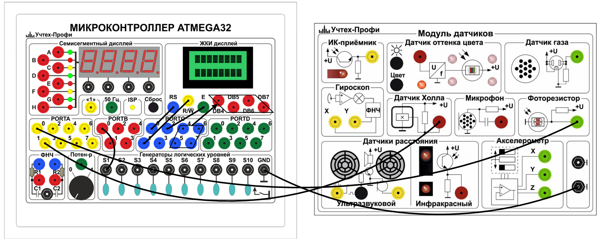

# Лабораторная работа № 1. "Фоторезистор как датчик освещённости. Датчик Холла для измерения магнитного поля"

*Знакомство со стендом. Датчики. Фоторезистор как датчик освещенности. Датчик Холла для измерения магнитного поля (наличия магнита).*

- [Цель работы](#цель-работы)
- [Оборудование](#оборудование)
- [Ход работы](#ход-работы)
  - [Теория](#теория)
  - [Подключение](#подключение)
  - [Использование кода](#использование-кода)
  - [Работа с фоторезистором](#работа-с-фоторезистором)
  - [Работа с датчиком Холла](#работа-с-датчиком-холла)
- [Вопросы](#вопросы)

## **Цель работы**

Знакомство со стендом: подключить модуль датчиков к модуля с микроконтроллером. Изучить основы работы с микроконтроллером, понятие простейшей периферии - порта и методики взаимодействия с ним. Изучить одну из разновидностей средств измерений - датчик. Овладеть знаниями о классификации датчиков. Определить, к какой группе датчиков следует относить датчик Холла и фоторезистор. Научиться получать правильные электрические показания с датчиков и преобразовывать в удобную для представления человека форму

## **Оборудование**

Модуль датчиков. Модуль «Микроконтроллер ATMEGA32, компьютер/ноутбук.

## **Ход работы**

### **Теория**

Изучите [теорический блок](Theory.md) к данной лабораторной. Также ознакомьтесь с пособием по использованию стендом, если не сделали этого раннее (его можно найти в папке `/Doc` основного [репозитория](https://github.com/albatron22/sensors-lab) лабораторных по сенсорами).

### **Подключение**

Подключите модуль "Микроконтроллер ATMEGA32", модуль "Модуль датчиков" к внешнему блоку питания (или у портам USB компьютера/ноутбука) с помощью кабеля USB. Выполните коммутацию модулей приборными проводами в соответствии с таблицей 1 с рис. 1.

|  |
| :----------------------------------------------------------: |
|             *Рис. 1. Схема подключения модулей*              |

*Таблица 1. Коммутация модулей*

| Порт микроконтроллера ATMEGA32 |            Назначение            |
| :----------------------------: | :------------------------------: |
|            PORTD:0             |          ЖК-дисплей: RS          |
|            PORTD:1             |         ЖК-дисплей: R/W          |
|            PORTD:2             |          ЖК-дисплей: E           |
|           PORTD:4-7            |       ЖК-дисплей: DB4-DB7        |
|            PORTA:0             |           Фоторезистор           |
|            PORTA:1             |           Датчик Холла           |
|            PORTB:0             | Генератор логических уровней: S1 |

### **Использование кода**

Для проведения измерений в лабораторной работе необходимо загрузить программу в микроконтроллер ATMEGA32. В папке `/src` лежат файлы исходного кода программы. Заголовочные файлы подключаемых модулей находятся `/include`. Основной выполняемый код находится в файле `/src/main.cpp`. Откройте его и проанализируйте код, который в нём содержится.

Запустите компиляцию и сборку прошивки нажав на кнопку "Build" на нижней панели VSCode. Затем загрузите файл прошивки в память микроконтроллера нажав на кнопку "Upload". После этого на ЖК-дисплее отобразятся измеряемые величины с подключённых датчиков. В случае с фоторезситором, на ЖК-дисплее будет отображно две строчки: сверху значение оцифрованное значение сигнала с фоторезистора 0-1023 ед., на нижней строчке будет отображено приблизительный уровень освещённости $L$, в $[лк]$. 

### **Работа с фоторезистором**

1. Переключите тумблер S1 генератора логических уровней в начальное положение. Тумблером S1 выбирается датчик, фоторезстор или датчик Холла, с которого в данный момент снимаются измерения.
2. Используйте точечный источник света (например, светодиод телефона). Облучайте им фоторезистор и снимите несколько показаний оцифрованного напряжения с фоторезситора и уровня освещенности при различных расстояниях между источником света и фоторезистором. Используйте для этого линейку. Полученные значения для нескольких расстояний занесите в таблицу ниже. Проведите 5-10 измерений с различными расстояниями.

| Расстояние $H$, $мм$ | Значение АЦП | Напряжение $V_{out}$, $В$ | Сопротивление $R_{ph}$, $кОм$ | Уровень освещенности $L$, $лк$ |
| :------------------: | :----------: | :-----------------------: | :---------------------------: | :----------------------------: |
|    5-10 измерений    |      -       |             -             |               -               |               -                |

3. По полученным данным постройте график зависимости $L=f(H)$ уровня освещенности $L$ от расстояния до источника света $H$. 

### **Работа с датчиком Холла**

1. Переключите тумблер S1 генератора логических уровней в крайнее положение. Таким образом выбираем датчик Холла в качестве источника измерений микроконтроллера.
2. Используя постоянный магнит проведите ряд измерения, поднося магниты обоими полюсами к датчика и фиксируя его показания. Определите максимальное расстояние, на котором датчик Холла срабаатывает на постоянный магнит. Сделайте вывод о типе датчика по его реакции на полюса магнита (униполярный, биполярный, оминполярный).

## **Вопросы**

1. Дайте определение фоторезистивному эффекту. Устройство и принцип работы фоторезистора.
2. Общая схема включения фоторезистора в измерительные схемы. Диапазон сопротивлений фоторезистора.
3. В чем заключается эффект Холла? Какие существуют типы датчиков на эффекте Холла?
4. Внутреннее устройство датчика Холла и схема его включения в измерительные схемы.